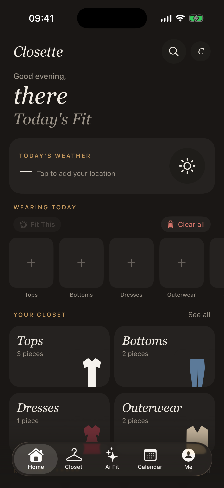
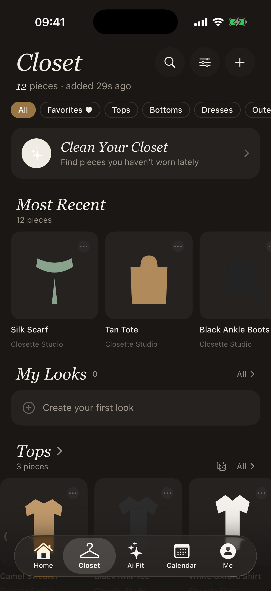
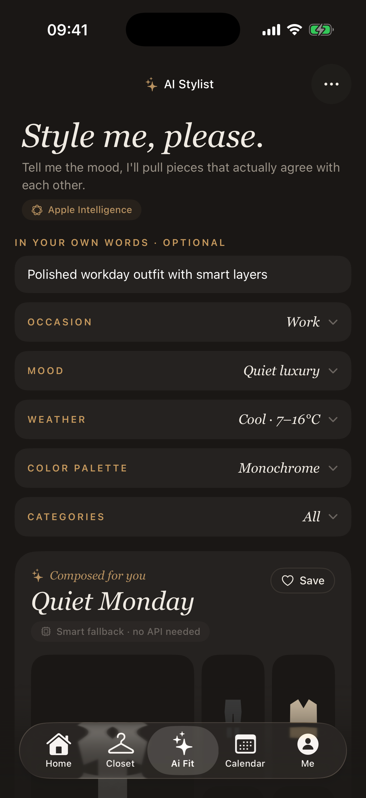
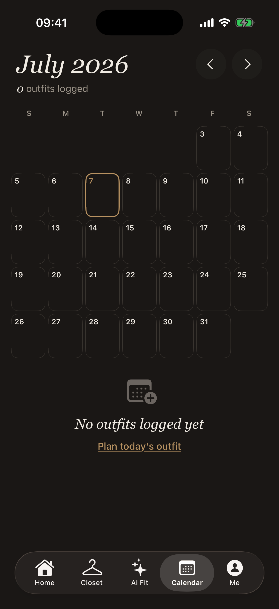
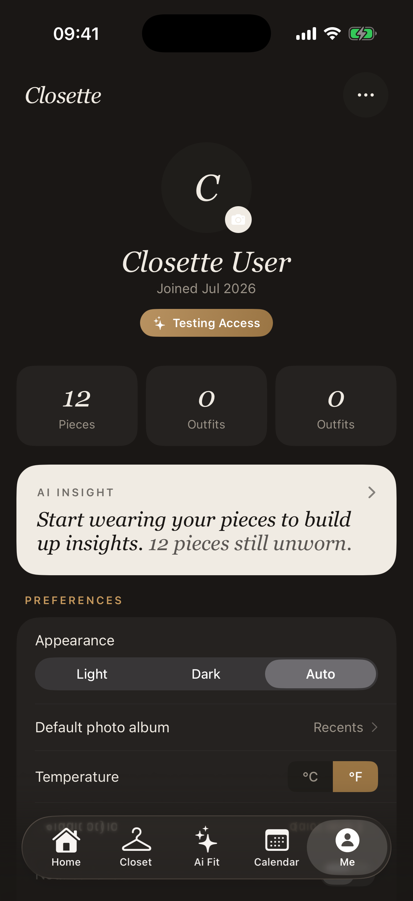

# Closette

Closette is a private iOS app project for AI-assisted wardrobe planning. This public repository is a portfolio showcase only: it contains screenshots and a product overview so recruiters and collaborators can evaluate the work without access to the app source, build files, binaries, or installable artifacts.

## Product Snapshot

Closette helps users turn their wardrobe into a searchable, style-aware closet. The app supports sample or personal closet setup, wardrobe organization, AI outfit generation, weather-aware styling, outfit planning, saved looks, profile settings, and membership-gated premium features.

## Screenshots

| Home | Closet | AI Fit |
| --- | --- | --- |
|  |  |  |

| Calendar | Profile |
| --- | --- |
|  |  |

## Featured Work

- AI Stylist flow that combines mood, occasion, weather, color palette, user notes, and closet inventory into outfit recommendations.
- Smart wardrobe model with categories, silhouettes, seasons, style tags, favorite state, wear counts, archived items, and saved outfits.
- Weather-aware styling and planning flows for daily outfit decisions.
- Closet organization with search, category filters, custom categories, item detail/edit flows, and sample closet onboarding.
- Premium membership system for advanced capabilities such as AI Fit and expanded closet limits.
- iOS-native integrations including widgets, App Intents, local persistence, and privacy-conscious on-device behavior where available.

## Technical Highlights

- SwiftUI-first iOS interface with reusable design tokens and custom garment rendering.
- SwiftData-backed wardrobe and outfit models with separated photo storage for better memory behavior.
- AI architecture designed around Apple Intelligence/Foundation Models when available, with a deterministic local stylist fallback so users still get instant outfit suggestions.
- StoreKit-based membership handling with testable entitlement logic.
- Widget and App Intent support for faster entry points into core wardrobe actions.
- Localized strings and accessibility-minded UI patterns across major screens.

## Repository Scope

This repository intentionally does not include:

- App source code
- Xcode project files
- Build scripts
- API keys or service configuration
- App binaries, TestFlight builds, or installable packages
- Private assets beyond the portfolio screenshots shown above

No license is granted for the Closette app, screenshots, brand, source code, product design, or related intellectual property. All rights reserved.

## Status

Closette is under private development for a planned App Store release. This public repository exists only as a resume and portfolio artifact.
